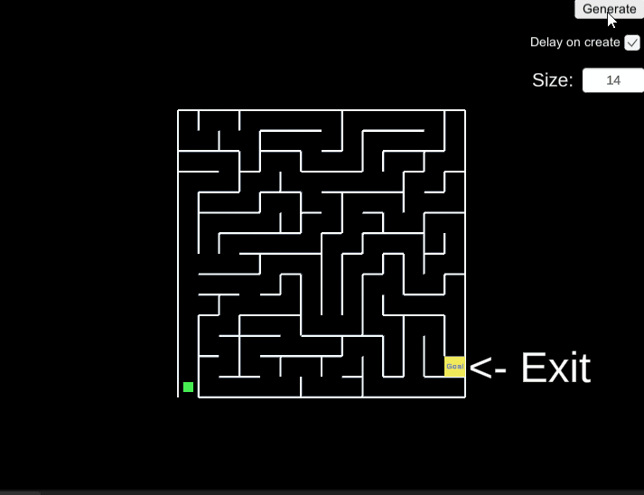
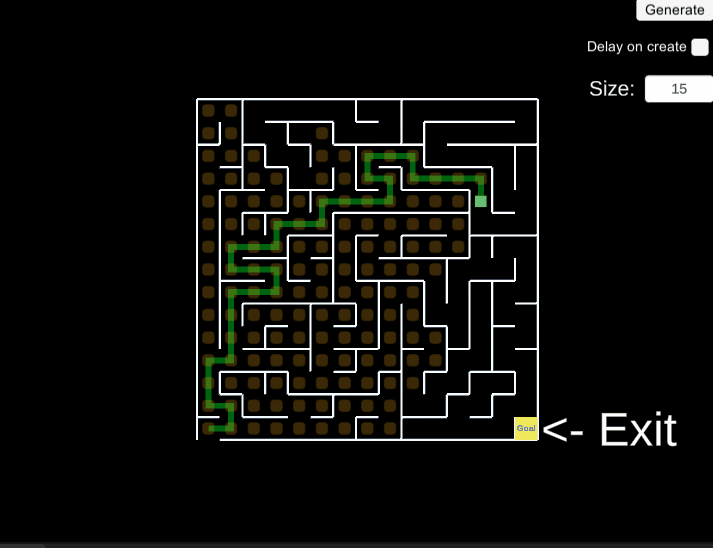

# Description
A procedural maze generated in Unity using A* Algorithm for navigation y the labyrinth

[Live demo](https://meaf75.github.io/unity-procedural-labyrinth-with-path-finding/)

# Requirements
- Unity 2020.3.19f1 or greatter

# Making of

Youtube
<iframe width="560" height="315" src="https://www.youtube.com/embed/KEG-WDzxqWI" title="YouTube video player" frameborder="0" allow="accelerometer; autoplay; clipboard-write; encrypted-media; gyroscope; picture-in-picture" allowfullscreen></iframe>
